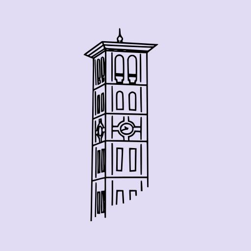

# Brand style guide: The Paladin Newspaper

_The Paladin Newspaper_ is the student newspaper of The Paladin Network.

::: tip

Don't forget to capitalize "The" in _The Paladin Newspaper_.

:::

Always include "The" in _The Paladin Newspaper_. If it does not feel natural to include the "The",
you need to rephrase the sentence.

## Short form

_The Paladin Newspaper_ can be shortened to _The Paladin_. It is best to always write out **The
Paladin Network** at least once.

::: warning

Both The **Paladin Network** and*The Paladin Newspaper* can be shortened to **The Paladin** and _The
Paladin_, respectively. For clarity, be sure to always italicize _The Paladin_ so readers know it
refers to the newspaper instead of the parent organization.

:::

## The Furman Paladin

_The Paladin Newspaper_ used to be called _The Furman Paladin_. The publication was renamed many
years ago and should no longer be called _The Furman Paladin_.

## Colors

There are three colors acceptable for use in materials for The Paladin Newspaper.

| Color  | Hex       | Example                                          |
| ------ | --------- | ------------------------------------------------ |
| Black  | `#000000` | 
                  |
| White  | `#ffffff` | 
 |
| Purple | `#6d38b7` | 
 |

Colors may be altered to different variants by changing the lightness without changing hue or
saturation. For example: `#523abb` is equal to `hsl(265, 53%, 47%)`, which can be altered to be
lighter or darker:

| HSL                  | Example                                                     |
| -------------------- | ----------------------------------------------------------- |
| `hsl(265, 53%, 47%)` | 
 |
| `hsl(265, 53%, 33%)` | 
 |
| `hsl(265, 53%, 60%)` | 
 |

## Fonts

### Adamant BG

Use Adamant BG for headlines and headings within articles. Do not use it outside of the context of
articles or other similar content.

##### Headline levels of emphasis

| Level | Weight | All-caps | Italic |
| ----- | ------ | -------- | ------ |
| 1     | 700    | ✔        | ✔      |
| 2     | 700    | ✔        |        |
| 3     | 700    |          | ✔      |
| 4     | 400    |          | ✔      |
| 5     | 400    |          |        |

##### Subheadings

Subheadings should be bolded (700) Adamant BG.

### Georgia

Use Georgia for long-form body text. Text should usually be 1.5 spacing.

### Lato

Use Lato for all other text.

[Download Lato from Google Fonts](https://fonts.google.com/specimen/Lato).

## Logo

### Wordmark

  

For instances where the wordmark needs to be smaller, you may use a bolder version for increased
visibility. Do not use the bold version unless the wordmark is small.

  

The wordmark color should either be white or black. Do not use color. Transparency is appropriate,
but only over solid-color backgrounds.

### Stylized wordmark

  

The stylized wordmark color should either be white or black. Do not use color. Transparency is
appropriate, but only over solid-color backgrounds.

### Square logo (filled)

  

The square logo color should never be modified. Do not make this logo transparent.

### Square logo (outlined)

  

The outlined square logo color should either be white or black. Do not use color. Transparency is
appropriate, but only over solid-color backgrounds.

### Tower

  

The tower color should either be white or black. Do not use color. Transparency is appropriate, but
only over solid-color backgrounds.
