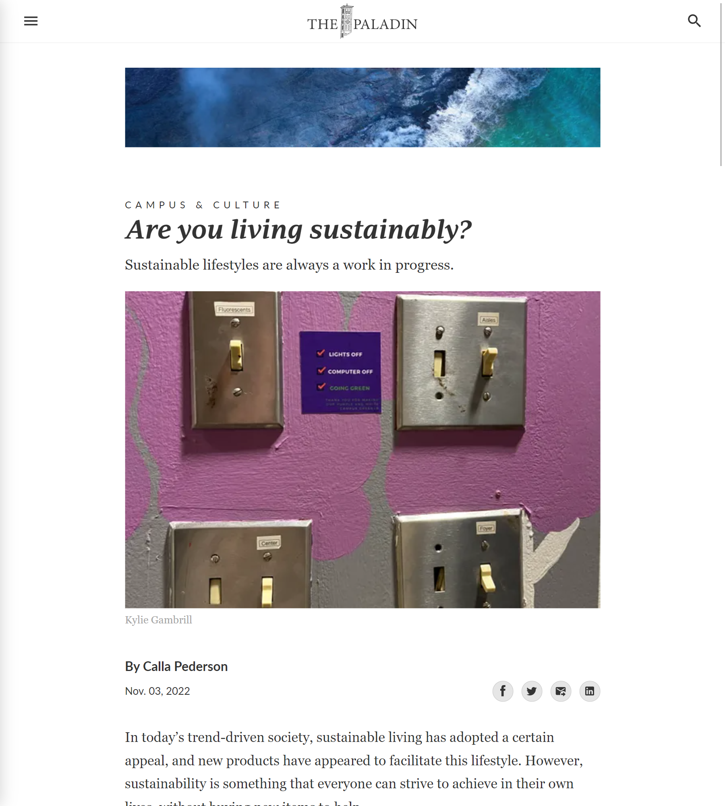
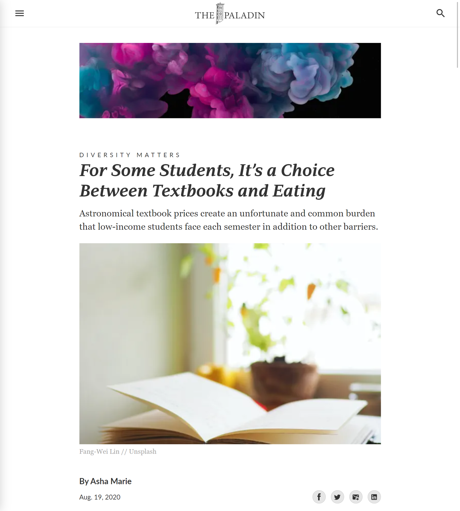
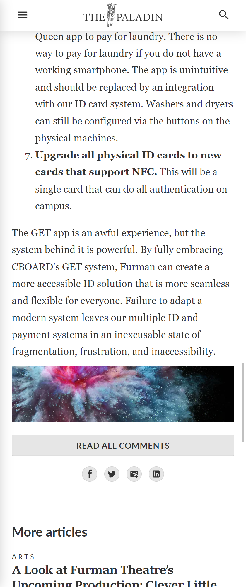
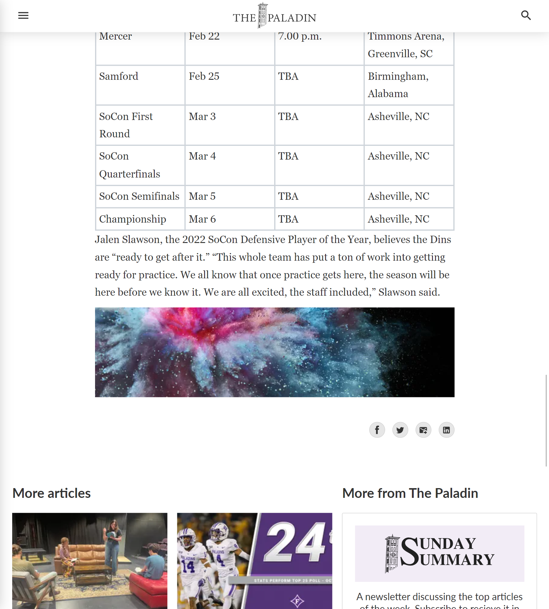

# Website advertising

Below are examples of advertisements on our website.

Rates and details can be found on our [Rate card page](./rate-card).

## Above article

This option places the advertisement right at the top of the page. It appears at the top for all
types of devices.

### 100 pixels tall

| Mobile                                      | Desktop                                      |
| ------------------------------------------- | -------------------------------------------- |
|  |  |

### 150 pixels tall

| Mobile                                      | Desktop                                      |
| ------------------------------------------- | -------------------------------------------- |
|  |  |

## Below article

This option places the advertisement immediately after the end of every article. When a reader
finishes an article, they see your ad.

| Mobile                                                     | Desktop                                                     |
| ---------------------------------------------------------- | ----------------------------------------------------------- |
|  |  |
